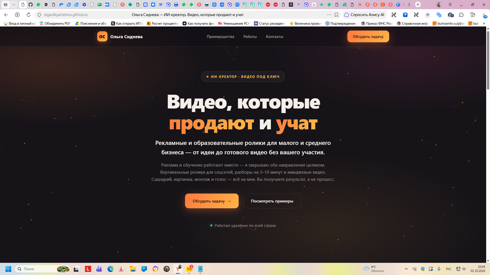
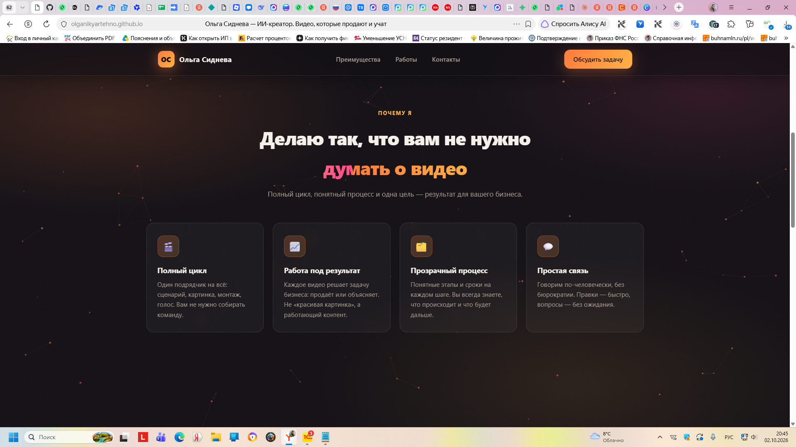
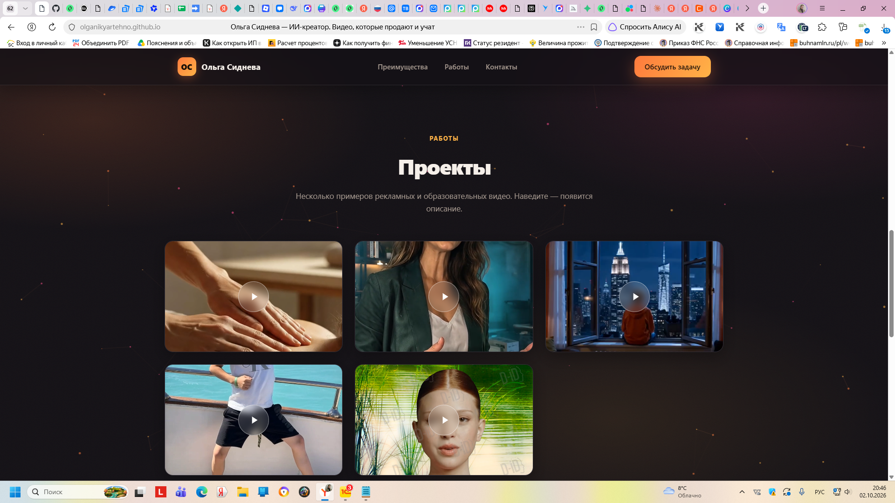

# Сайт-портфолио ИИ-креатора

Одностраничный сайт-портфолио для ИИ-креатора, который делает рекламные и образовательные видео под ключ для малого и среднего бизнеса.

**Сайт:** https://olganikyartehno.github.io/site/

## Скриншоты

| Главный экран | Преимущества |
|---|---|
|  |  |



---

## Название

**Сайт-портфолио ИИ-креатора** — «Видео, которые продают и учат».

Автор проекта: **Ольга Сиднева** ([GitHub](https://github.com/Olganikyartehno)).

---

## Решаемая задача

Малому и среднему бизнесу нужен видеоконтент — рекламные ролики для соцсетей, обучающие видео, имиджевые ролики для сайта и презентаций. Обычно это упирается в три проблемы:

1. **Нет команды.** Чтобы сделать один ролик, нужно нанять сценариста, оператора, монтажёра, диктора. Для небольшой компании это дорого и долго.
2. **Процесс непрозрачен.** Клиент не понимает, что происходит с его заказом, сколько это займёт по времени и сколько будет стоить.
3. **Контент «ради контента».** Ролики снимают «просто потому что», и они не решают задачу бизнеса: не приводят заявки и не объясняют ценность продукта.

Проект решает эти задачи: один исполнитель берёт на себя весь цикл — сценарий, картинка, монтаж и голос — и работает под конкретную цель клиента (заявки, продажи или узнаваемость).

---

## Пользователь

**Целевая аудитория сайта:**

| Кто | Что у него за проблема | Что ищет на сайте |
|---|---|---|
| Предприниматель малого и среднего бизнеса (онлайн-школы, локальные сервисы, магазины) | Нужны видео для продаж и обучения, но нет команды и бюджета на продакшн | Понимание, что нанять одного исполнителя решает задачу |
| Маркетолог или владелец бизнеса | Нужен видеоконтент на потоке для соцсетей | Примеры работ, форматы, понимание результата |
| Заказчик, который уже ищет исполнителя | Ищет, кому доверить задачу | Портфолио, кейсы и простой способ связаться |

Пользователь заходит на сайт, чтобы за 30 секунд понять: кто автор, что он делает, какие форматы закрывает, посмотреть примеры работ и оставить заявку.

---

## Что внутри

- **Главный экран** — оффер, описание услуги, призывы к действию.
- **Преимущества** — полный цикл под ключ, работа под результат, прозрачный процесс, простая связь.
- **Галерея работ** — видео подтягиваются с GitHub через CDN (jsDelivr) с запасным источником.
- **Статистика** — счётчики анимируются при прокрутке.
- **Контакты** — блок заявки, email и Telegram.

### Особенности и интерактив

- Анимированный фон: живые частицы, реагирующие на курсор, плюс дрейфующие градиенты и зернистость.
- Анимации появления блоков при прокрутке (`IntersectionObserver`).
- Анимированные счётчики цифр.
- Эффектные кнопки с бликом и свечением.
- Видео в галерее проигрывается при наведении.

### Форматы видео

- Вертикальные ролики для соцсетей (15–60 сек).
- Средний формат: разборы и объяснения (3–10 мин).
- Образовательные видео и имиджевые ролики.

---

## Технологии

- Чистый HTML + CSS + JavaScript (без фреймворков и сборки).
- Анимации — на CSS и Canvas 2D.
- Видео — через `cdn.jsdelivr.net` с fallback на `raw.githubusercontent.com`.
- Хостинг — GitHub Pages.

---

## Структура проекта

```
.
├── index.html           # основной файл сайта (HTML + CSS + JS)
├── README.md            # этот файл
├── otklik-shablon.md    # шаблон отклика клиенту
├── images/              # скриншоты сайта для README
│   ├── 2026-10-02_20-45-22.png
│   ├── 2026-10-02_20-45-32.png
│   └── 2026-10-02_20-46-15.png
└── Video/               # видео проектов
    ├── Видео1.mp4
    ├── Аватар 1 без озвучки.mp4
    ├── 17982225386186.mp4
    ├── 6a807b6cecaf2a85bfe61629.mp4
    └── Untitled video.mp4
```

Чтобы добавить новое видео: загрузите файл в папку `Video/` и добавьте запись в массив `VIDEOS` в скрипте `index.html`.

---

## Как запустить

Проект — статический сайт, сборка не нужна.

**Вариант 1.** Открыть `index.html` в браузере.

**Вариант 2.** Локальный сервер (для корректной загрузки видео):

```bash
python -m http.server 8000
```

Открыть http://localhost:8000

**Публикация:** сайт размещён на GitHub Pages — https://olganikyartehno.github.io/site/

Чтобы обновить сайт, достаточно загрузить изменённый `index.html` в репозиторий — Pages соберёт его автоматически.

---

## Контакты

- **Email:** olganik_yartehno@mail.ru
- **Telegram:** [@olganik_yartehno](https://t.me/olganik_yartehno)